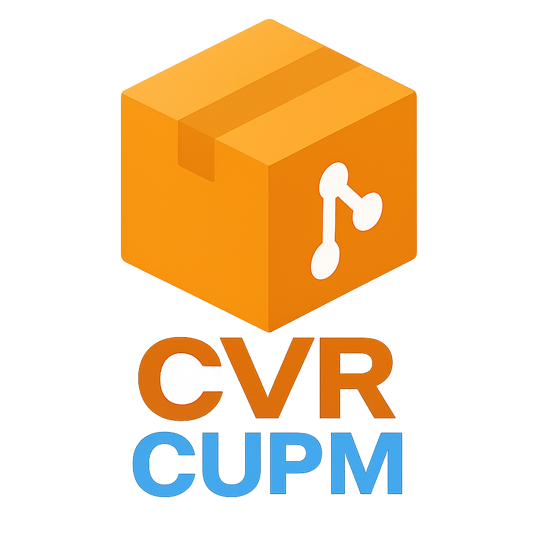

<!-- Improved compatibility of back to top link: See: https://github.com/othneildrew/Best-README-Template/pull/73 -->

<a name="readme-top"></a>

<!-- PROJECT SHIELDS -->

<!--
*** I'm using markdown "reference style" links for readability.
*** Reference links are enclosed in brackets [ ] instead of parentheses ( ).
*** See the bottom of this document for the declaration of the reference variables
*** for contributors-url, forks-url, etc. This is an optional, concise syntax you may use.
*** https://www.markdownguide.org/basic-syntax/#reference-style-links
-->

[![Contributors][contributors-shield]][contributors-url]
[![Forks][forks-shield]][forks-url]
[![Stargazers][stars-shield]][stars-url]
[![Issues][issues-shield]][issues-url]
[![MIT License][license-shield]][license-url]

<!-- PROJECT LOGO -->

<br />
<div align="center">
  <a href="https://github.com/NovaVoidHowl/CVR-Community-Unity-Package-Manager">
    
  </a>

<h3 align="center">CVR Community Unity Package Manager</h3>

<p align="center">
  <br />
  <!-- <a href="https://github.com/NovaVoidHowl/CVR-Community-Unity-Package-Manager"><strong>Explore the docs »</strong></a>
  <br />
  <br /> -->
  <a href="https://github.com/NovaVoidHowl/CVR-Community-Unity-Package-Manager/issues">Report Bug</a>
  ·
  <a href="https://github.com/NovaVoidHowl/CVR-Community-Unity-Package-Manager/issues">Request Feature</a>
</p>
</div>

<!-- TABLE OF CONTENTS -->

<details>
  <summary>Table of Contents</summary>
  <ol>
    <li>
      <a href="#about-the-project">About The Project</a>
      <ul>
        <li><a href="#features">Features</a></li>
        <li><a href="#technology-stack">Technology Stack</a></li>
      </ul>
    </li>
    <li>
      <a href="#getting-started">Getting Started</a>
      <ul>
        <li><a href="#prerequisites">Prerequisites</a></li>
        <li><a href="#installation">Installation</a></li>
      </ul>
    </li>
    <li>
      <a href="#usage">Usage</a>
      <ul>
        <li><a href="#getting-started-with-the-app">Getting Started with the App</a></li>
        <li><a href="#how-to-video---windows-10">How To Video - Windows 10</a></li>
        <li><a href="#how-to-video---windows-11">How To Video - Windows 11</a></li>
        <li><a href="#key-features">Key Features</a></li>
        <li><a href="#package-registries">Package Registries</a></li>
        <li><a href="#conflict-detection">Conflict Detection</a></li>
      </ul>
    </li>
    <li><a href="#configuration">Configuration</a></li>
    <ul>
      <li><a href="#config-file-locations">Config File Locations</a></li>
    </ul>
    <li><a href="#development">Development</a></li>
    <li><a href="#current-status">Current Status</a></li>
    <li><a href="#contributing">Contributing</a></li>
    <li><a href="#license">License</a></li>
    <li><a href="#acknowledgments">Acknowledgments</a></li>
    <li><a href="#contact">Contact</a></li>
  </ol>
</details>

<!-- ABOUT THE PROJECT -->

## About The Project

The CVR Community Unity Package Manager simplifies the process of installing, updating, and managing Unity packages that
are distributed through Git repositories.
Instead of manually adding packages through Unity's Package Manager with Git URLs, users can manage everything through a
simple, intuitive desktop interface.

> [!note]
> This application is not created by or affiliated with ChilloutVR or the ChilloutVR team in any way

<p align="right">(<a href="#readme-top">back to top</a>)</p>

### Features

- **Cross-Platform Support**: Works on Windows, Linux, and macOS
- **Registry Management**: Add and manage package registry URLs
- **Project Management**: Handle multiple Unity projects from one interface
- **Package Operations**: Install, update, downgrade, and remove packages with ease
- **Advanced Git Integration**: Direct Git repository cloning with tag/branch checkout
- **Conflict Detection**: Automatically detects and resolves package conflicts
- **Version Management**: Support for multiple package versions with smart defaults
- **Theme Support**: Dark, Light, and Follow System theme options
- **No Unity Dependencies**: Works independently of Unity Editor through direct Git operations
- **Manifest Management**: Automatically updates Unity's manifest.json file

> [!tip]
> Pre-built installers are currently only available for windows
>

<p align="right">(<a href="#readme-top">back to top</a>)</p>

### Technology Stack

- **Backend**: Rust with Tauri framework
- **Frontend**: HTML/CSS/JavaScript with tabbed interface
- **Git Operations**: libgit2 via git2 crate with direct repository cloning
- **HTTP Requests**: reqwest for fetching package registries
- **Configuration**: JSON-based local configuration storage with theme persistence
- **Conflict Resolution**: Advanced conflict detection and resolution system

<p align="right">(<a href="#readme-top">back to top</a>)</p>

<!-- GETTING STARTED -->

## Getting Started

### Prerequisites

- Valid Unity projects to manage

### Installation

Download the installer from the latest release, and install from that

<p align="right">(<a href="#readme-top">back to top</a>)</p>

<!-- USAGE EXAMPLES -->

## Usage

### Getting Started with the App

1. **First Launch**: On first launch, the app will create a configuration file for storing your settings
2. **Add Registries**: Start by adding package registry URLs in the registries tab
3. **Add Projects**: Configure your Unity projects in the project info tab
4. **Manage Packages**: Use the package management tab to install, update, or remove packages

### How To Video - Windows 10
[](https://www.youtube.com/watch?v=TIoApgXhzP0)

### How To Video - Windows 11
[](https://www.youtube.com/watch?v=CTlnMo__c0Q)

<p align="right">(<a href="#readme-top">back to top</a>)</p>

### Key Features

- **Registry Management**: Add URLs pointing to package registry JSON files
- **Project Selection**: Choose which Unity project to work with
- **Package Installation**: Install packages directly from Git repositories (no unity/system installed git dependencies)
- **Version Control**: Choose specific versions or use latest stable
- **Conflict Resolution**: Automatic detection and resolution of package conflicts
- **Theme Customization**: Switch between Dark, Light, and System themes

<p align="right">(<a href="#readme-top">back to top</a>)</p>

### Package Registries

The application supports loading package information from JSON registry files (expected to be hosted online).
Please see an example file [sample-registry.json](sample-registry.json) in the root of this repo.

<p align="right">(<a href="#readme-top">back to top</a>)</p>

### Conflict Detection

The application provides comprehensive conflict detection:

- **Dependency Conflicts**: Detects when packages require different versions of the same dependency
- **Version Conflicts**: Identifies incompatible package versions
- **Resolution Suggestions**: Provides automated resolution options when conflicts are detected

<p align="right">(<a href="#readme-top">back to top</a>)</p>

<!-- CONFIGURATION -->

## Configuration

Configuration is stored in JSON format and includes:

- Registry URLs
- Unity project paths
- User preferences (theme, default options)
- Package installation history

### Config File Locations

Windows: `%appdata%/cvr-unity-package-manager`

<p align="right">(<a href="#readme-top">back to top</a>)</p>

<!-- DEVELOPMENT -->

## Development

### Setting Up the Development Environment

1. **Install Prerequisites**: Ensure Rust and Node.js are installed
2. **Clone and Setup**: Follow the installation steps above
3. **Run in Development Mode**:

   ```bash
   cargo tauri dev
   ```

### Project Structure

- `src-tauri/`: Rust backend code
  - `src/main.rs`: Application entry point
  - `src/git_operations.rs`: Git repository operations
  - `src/package_manager.rs`: Package management logic
- `src/`: Frontend code
  - `index.html`: Main application interface
  - `styles.css`: Application styling
  - `script.js`: Frontend logic and API calls

### Building for Distribution

```bash
cargo tauri build
```

This creates platform-specific installers in `src-tauri/target/release/bundle/`.

### Further Development info

Please see [DEV-SETUP.md](DEV-SETUP.md) and [CONTRIBUTING.md](CONTRIBUTING.md) for more details.

<p align="right">(<a href="#readme-top">back to top</a>)</p>

<!-- CURRENT STATUS -->

## Current Status

- ✅ Core functionality implemented
- ✅ Git integration with libgit2
- ✅ Package installation and management
- ✅ Conflict detection and resolution
- ✅ Cross-platform builds
- ✅ Theme system
- ✅ Registry management
- 🔄 Additional features planned based on community feedback

<p align="right">(<a href="#readme-top">back to top</a>)</p>

<!-- CONTRIBUTING -->

## Contributing

Contributions are what make the open source community such an amazing place to learn, inspire, and create.
Any contributions you make are **greatly appreciated**.

If you have a suggestion that would make this better, please fork the repo and create a pull request. You can also
simply open an issue with the tag "enhancement".
Don't forget to give the project a star! Thanks again!

1. Fork the Project
2. Create your Feature Branch (`git checkout -b feature/AmazingFeature`)
3. Commit your Changes (`git commit -m 'Add some AmazingFeature'`)
4. Push to the Branch (`git push origin feature/AmazingFeature`)
5. Open a Pull Request

<p align="right">(<a href="#readme-top">back to top</a>)</p>

<!-- LICENSE -->

## License

Distributed under the MIT License. See [LICENSE](LICENSE.md) for more information.

<p align="right">(<a href="#readme-top">back to top</a>)</p>

<!-- ACKNOWLEDGMENTS -->

## Acknowledgments

- Built with [Tauri](https://tauri.app/) for cross-platform desktop development
- Uses [libgit2](https://libgit2.org/) for Git operations
- Inspired by the ChilloutVR tool/utility development community

<p align="right">(<a href="#readme-top">back to top</a>)</p>

<!-- CONTACT -->

## Contact

Project Link: [https://github.com/NovaVoidHowl/CVR-Community-Unity-Package-Manager](https://github.com/NovaVoidHowl/CVR-Community-Unity-Package-Manager)

<p align="right">(<a href="#readme-top">back to top</a>)</p>

<!-- MARKDOWN LINKS & IMAGES -->
<!-- https://www.markdownguide.org/basic-syntax/#reference-style-links -->
[contributors-shield]: https://img.shields.io/github/contributors/NovaVoidHowl/CVR-Community-Unity-Package-Manager.svg?style=plastic
[contributors-url]: https://github.com/NovaVoidHowl/CVR-Community-Unity-Package-Manager/graphs/contributors
[forks-shield]: https://img.shields.io/github/forks/NovaVoidHowl/CVR-Community-Unity-Package-Manager.svg?style=plastic
[forks-url]: https://github.com/NovaVoidHowl/CVR-Community-Unity-Package-Manager/network/members
[stars-shield]: https://img.shields.io/github/stars/NovaVoidHowl/CVR-Community-Unity-Package-Manager.svg?style=plastic
[stars-url]: https://github.com/NovaVoidHowl/CVR-Community-Unity-Package-Manager/stargazers
[issues-shield]: https://img.shields.io/github/issues/NovaVoidHowl/CVR-Community-Unity-Package-Manager.svg?style=plastic
[issues-url]: https://github.com/NovaVoidHowl/CVR-Community-Unity-Package-Manager/issues
[license-shield]: https://img.shields.io/github/license/NovaVoidHowl/CVR-Community-Unity-Package-Manager.svg?style=plastic
[license-url]: https://github.com/NovaVoidHowl/CVR-Community-Unity-Package-Manager/blob/master/LICENSE
